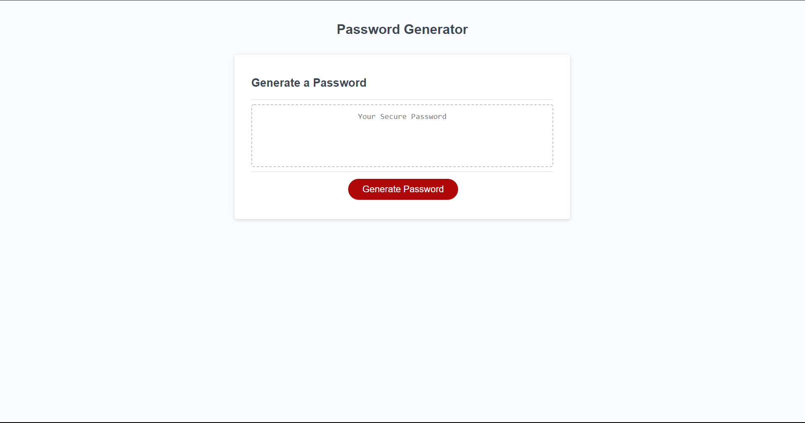

# Password-Generator

Button that will prompt user how many charcters they would like in the password.

Prompt will return user to start if they choose a amount lower than 8 or higher than 128.

The user will be prompted 4 times asking if they would like to include capital letters, lowercase letters, numbers, or special characters.

The user will be shown a password on screen that matches all criteria.

